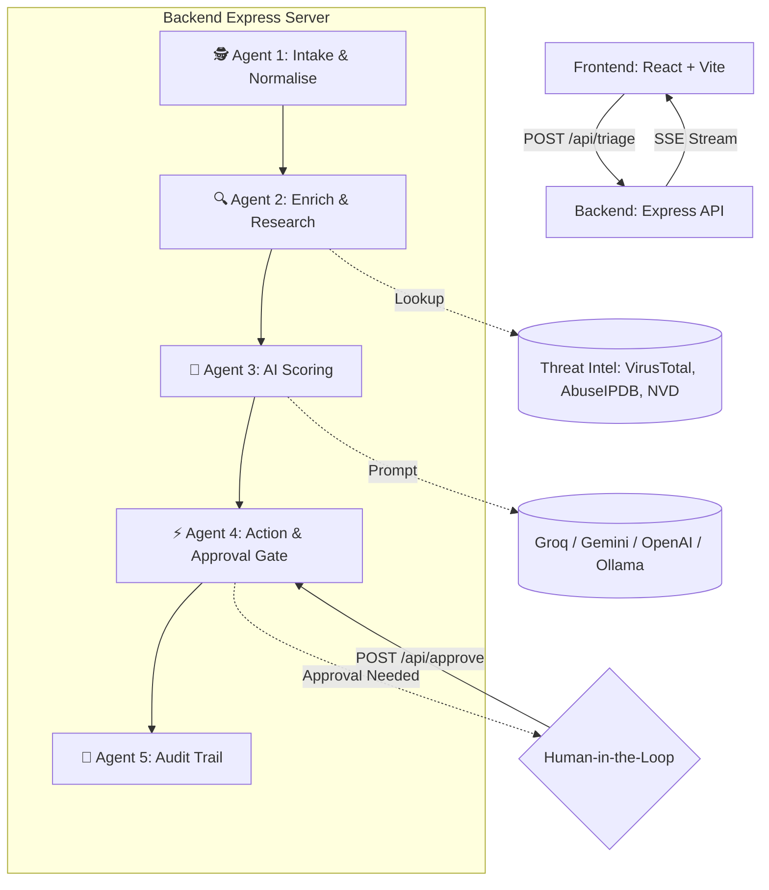

# 🛡️ SOC Triage Agent — AI-Powered Security Operations


A real-time, full-stack **AI-powered Security Operations Center (SOC) triage tool**.
This application drastically reduces Mean Time To Respond (MTTR) by autonomously parsing, enriching, and scoring security alerts. It acts as an intelligent first-line defender, surfacing critical threats and automating initial response actions while keeping humans in the loop for high-risk decisions.

---

## ⚡ Key Features

- **🤖 5-Stage Multi-Agent AI Pipeline**: Intelligent agents working in sequence to Handle Intake, Enrichment, Scoring, Execution, and Auditing.
- **⚡ Real-Time Streaming (SSE)**: Live streaming of the agent's thought processes, decisions, and actions straight to the UI.
- **🛡️ Threat Intel Integrations**: Built-in support for AbuseIPDB, VirusTotal, and NIST NVD for enriching IOCs (Indicators of Compromise).
- **🧠 Multi-LLM Support**: Highly resilient AI scoring with seamless fallback between **Groq (Llama 3)**, **Google Gemini 1.5 Flash**, **OpenAI GPT-3.5**, and local **Ollama**.
- **🧑‍💻 Human-in-the-Loop**: Auto-executes actions for Low/Medium/Critical threats, but enforces an approval gate for "High" severity incidents requiring human judgment.
- **📊 Comprehensive Audit Trail**: Generates a tamper-evident audit log for post-incident review and compliance.

---

## 🏗️ System Architecture & Design

The system follows an event-driven, pipeline-based architecture consisting of a React frontend communicating with an Express backend via REST and Server-Sent Events (SSE).

### 1. High-Level Flow 



### 2. The 5 Agents Explained

1. **Agent 1 (Intake & Normalise)**: Classifies the alert (e.g., Ransomware, Bruteforce), extracts IOCs (IPs, CVEs, Domains), and maps behavior to the MITRE ATT&CK framework.
2. **Agent 2 (Enrichment)**: reaches out to external Threat Intelligence APIs to gather reputation scores, malicious activity reports, and CVSS severity metrics.
3. **Agent 3 (AI Score & Decide)**: Sends the normalized context and enriched data to a chosen LLM to perform advanced heuristic analysis, yielding a JSON-structured response with severity, confidence, false-positive likelihood, and recommended actions.
4. **Agent 4 (Action)**: Executes recommended actions automatically or triggers a human approval workflow depending on severity gates.
5. **Agent 5 (Audit)**: Consolidates execution time, context, and steps taken into a final ticket record.

---

## 🚀 Setup & Local Installation

### Prerequisites
- Node.js (v18+)
- npm or yarn
- API Keys for one or more supported AI providers (Groq, Gemini, OpenAI). Alternatively, a running instance of Ollama.
- (Optional but recommended) Keys for AbuseIPDB, VirusTotal, NVD Nist.

### 1. Clone & Setup Backend

```bash
cd backend
npm install
```

### 2. Configure Environment Variables
Inside the `backend` directory, create a `.env` file from the provided `.env.example` (or configure via the `backend/.env` file that exists in the repo):

```env
PORT=3001

# --- LLM Providers (At least one is required) ---
GROQ_API_KEY=your_groq_key_here
GEMINI_API_KEY=your_gemini_key_here
OPENAI_API_KEY=your_openai_key_here

# Local AI (Ollama - fallback)
OLLAMA_URL=http://localhost:11434
OLLAMA_MODEL=llama3

# --- Threat Intelligence APIs (Optional but recommended) ---
VIRUSTOTAL_API_KEY=your_vt_key
ABUSEIPDB_API_KEY=your_abuseipdb_key
NVD_API_KEY=your_nvd_key
```

### 3. Run Backend Server
```bash
node server.js
# Runs on defaults: http://localhost:3001
```

### 4. Setup & Run Frontend
In a new terminal:
```bash
cd frontend
npm install
npm run dev
# Vite server starts on: http://localhost:5173
```

---

## 📝 Usage Guide

1. **Access the Dashboard**: Open your browser and navigate to `http://localhost:5173`.
2. **Input an Alert**: Paste raw system logs, EDR alerts, user-reported phishing emails, or use one of the pre-built templates (e.g., *SSH Brute Force*, *Ransomware Lateral Movement*).
3. **Initiate Triage**: Click **Run AI Triage**.
4. **Monitor Real-Time SSE Pipeline**: Watch as the incident is passed off from normalisation to enrichment, then scoring. 
5. **Human Approval**: If the LLM deems the alert's severity as **High**, the UI will prompt an approval dialog to allow actions to proceed. Provide analyst notes and Accept/Reject.

---

## 🔮 Future Enhancements & Production Roadmap

- **Database Persistence**: Integrate PostgreSQL/MongoDB for storing persistent audit logs, tickets, and analyst metrics.
- **Ticketing Integration**: Native two-way sync with Jira Service Desk, PagerDuty, or ServiceNow in Agent 4.
- **Webhooks Response**: Slack/Teams automated webhook alerts.
- **Authentication**: Add JWT auth + RBAC (Role-Based Access Control) for SOC Analysts vs. Viewers.

---
