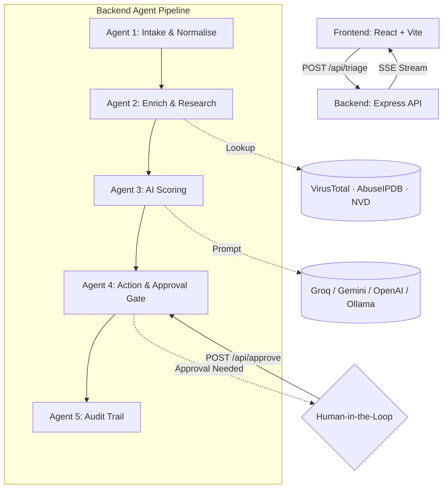

<div align="center">

[](https://soc-agent-rosy.vercel.app/)


</div>

---

## Overview

**SOC Triage Agent** is a real-time, full-stack AI security operations tool designed to drastically reduce Mean Time To Respond (MTTR). It autonomously parses, enriches, and scores incoming security alerts through a 5-stage multi-agent pipeline — surfacing critical threats and executing initial response actions while keeping human analysts in the loop for high-severity decisions.

Built on an event-driven architecture, the agent streams its reasoning and actions live to the UI via Server-Sent Events, giving analysts full visibility into every decision made.

---

## Features

- **5-stage multi-agent pipeline** — sequential agents for Intake, Enrichment, AI Scoring, Action Execution, and Audit
- **Real-time SSE streaming** — live feed of agent thought processes, decisions, and actions directly to the dashboard
- **Threat intel integrations** — AbuseIPDB, VirusTotal, and NIST NVD for enriching IPs, domains, and CVEs
- **Multi-LLM with fallback** — resilient scoring across Groq (Llama 3), Google Gemini 1.5 Flash, OpenAI GPT-3.5, and local Ollama
- **Human-in-the-loop gate** — Low/Medium/Critical alerts execute automatically; High severity triggers an analyst approval dialog before any action proceeds
- **Tamper-evident audit trail** — full ticket record with execution time, steps taken, and context for compliance and post-incident review
- **MITRE ATT&CK mapping** — alert classification includes framework technique mapping at the intake stage

---

## Architecture

The system follows an event-driven, pipeline-based design. The React frontend communicates with an Express backend via REST for submission and SSE for live streaming.



### The 5 Agents

| Agent | Role | Key Output |
|---|---|---|
| **1 — Intake & Normalise** | Classifies alert type, extracts IOCs, maps to MITRE ATT&CK | Structured alert object |
| **2 — Enrichment** | Queries threat intel APIs for IP/domain reputation and CVE CVSS scores | Enriched IOC context |
| **3 — AI Scoring** | Sends normalised + enriched context to LLM for heuristic analysis | Severity, confidence, false-positive likelihood, recommended actions |
| **4 — Action & Approval** | Auto-executes for Low/Medium/Critical; gates High severity for human approval | Executed or pending actions |
| **5 — Audit** | Consolidates all steps, decisions, and metadata into a final ticket record | Immutable audit log |

---

## Getting Started

**Prerequisites:** Node.js 18+, npm or yarn, at least one LLM API key (Groq, Gemini, or OpenAI), or a running Ollama instance.

### 1. Clone the repository

```bash
git clone https://github.com/Saif8671/soc-triage-agent.git
cd soc-triage-agent
```

### 2. Configure environment variables

```bash
cp backend/.env.example backend/.env
```

```env
PORT=3001

# LLM Providers (at least one required)
GROQ_API_KEY=your_groq_key_here
GEMINI_API_KEY=your_gemini_key_here
OPENAI_API_KEY=your_openai_key_here

# Local AI fallback (Ollama)
OLLAMA_URL=http://localhost:11434
OLLAMA_MODEL=llama3

# Threat Intelligence APIs (optional but recommended)
VIRUSTOTAL_API_KEY=your_vt_key
ABUSEIPDB_API_KEY=your_abuseipdb_key
NVD_API_KEY=your_nvd_key
```

### 3. Run the backend

```bash
cd backend
npm install
node server.js
# Runs on http://localhost:3001
```

### 4. Run the frontend

```bash
cd frontend
npm install
npm run dev
# Vite dev server at http://localhost:5173
```

---

## Usage

1. Open the dashboard at `http://localhost:5173`
2. Paste a raw alert — system logs, EDR output, phishing report — or use a pre-built template (SSH Brute Force, Ransomware Lateral Movement, etc.)
3. Click **Run AI Triage**
4. Watch the SSE pipeline stream live: normalisation → enrichment → AI scoring → action
5. If severity is assessed as **High**, an analyst approval dialog appears — review the context, add notes, then accept or reject the proposed actions

---

## Roadmap

| Status | Feature |
|---|---|
| 📋 Planned | PostgreSQL / MongoDB persistence for audit logs and analyst metrics |
| 📋 Planned | Native ticketing sync with Jira Service Desk, PagerDuty, ServiceNow |
| 📋 Planned | Slack / Teams webhook alerts from Agent 4 |
| 📋 Planned | JWT authentication + RBAC (SOC Analyst vs. Viewer roles) |

---

## Contributing

1. Fork the repository
2. Create a feature branch: `git checkout -b feat/your-feature`
3. Commit with conventional messages: `git commit -m "feat: describe your change"`
4. Push and open a pull request

---

## License

MIT © [Saif ur Rahman](https://github.com/Saif8671)
Free to use, modify, and distribute with attribution.

---

<div align="center">

**Built by [Saif ur Rahman](https://github.com/Saif8671)**

[](https://github.com/Saif8671)
[](https://linkedin.com/in/saif-ur-rahman-0211002b9)
[](https://saif-portfolio8671.netlify.app)
[](mailto:saifurrahman887@gmail.com)

<br/>

*Faster triage. Fewer blind spots. Humans where it matters.*


</div>
